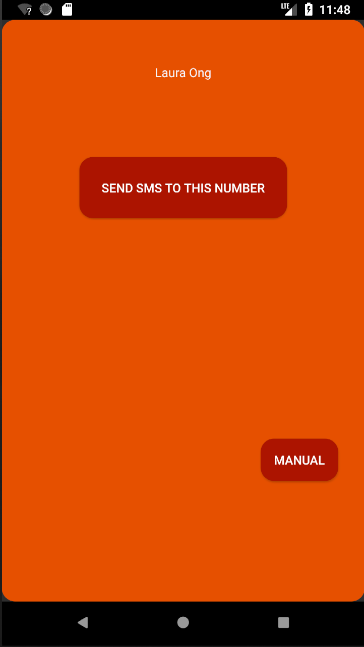

# MQTT Android Service Tutorial
A tutorial for using the MQTT Android Service, as seen on https://wildanmsyah.wordpress.com/2017/05/11/mqtt-android-client-tutorial/

### Requirements:
- Android Studio
- [Paho MQTT Android Service](https://github.com/eclipse/paho.mqtt.android)
- [CloudMQTT Broker](https://www.cloudmqtt.com/)

### Functionality:
  -Retrieves from cloudMQTT broker messages uploaded by Server
  -Allows user to decide whether to send verification message or not. Could opt for automatic sending and manual testing
  (SMS2.png)
### How to modify MqttHelper.java:
  Make change to CloudMQTT server by changing serverUri variable on line 20, clientId, username and password to suitable cloudmqtt broker corresponding names.
  Able to distinguish between topics by changing variable subscriptionTopic on line 23
## Tests
Tests on validity of the correct kind of numbers. 
## Unimplemented Features

Currently, all features that we have planned are implemented. However, we have a few features that we would like to work on should we be given the opportunity to make this into a production level app:

**Company branding:** Would wish to change the skins of the apps accordingly. 
**Additional Customization** Currently working through using an Android App. Would like to port to Apple or to web. 
